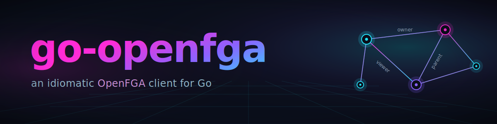

<p align="center">
  
</p>

<h1 align="center">go-openfga</h1>

<div align="center">

[](https://github.com/sergiught/go-openfga/actions/workflows/ci.yml)
[](https://github.com/sergiught/go-openfga/actions/workflows/codeql.yml)
[](https://codecov.io/gh/sergiught/go-openfga)
[](https://pkg.go.dev/github.com/sergiught/go-openfga/openfga)
[](https://securityscorecards.dev/viewer/?uri=github.com/sergiught/go-openfga)
[](https://github.com/sergiught/go-openfga/releases)
[](go.mod)
[](LICENSE)
[](https://www.conventionalcommits.org)
[](CONTRIBUTING.md)

</div>

A hand-crafted, idiomatic Go client for the [OpenFGA](https://openfga.dev) HTTP API,
modeled on the design quality of [`google/go-github`](https://github.com/google/go-github).

The client is auth-agnostic at its core: it owns only an `*http.Client`, and
authentication, retries, and custom headers are layered as composable
`http.RoundTripper` transports. Its consumer-facing dependency footprint is just
`golang.org/x/oauth2` and `github.com/golang-jwt/jwt/v5`.

## Features

- **Full v1 API coverage** — stores, authorization models, relationship tuples, all
  relationship queries (check, batch-check, expand, list-objects, list-users), and
  assertions.
- **Four authentication modes** — no-auth, pre-shared API token, OAuth2
  client-credentials, and private-key JWT (RFC 7523 client assertion).
- **Auto-paginating iterators** — Go 1.23 range-over-func for stores, models, tuple
  reads and changes, plus manual cursor control when you need it.
- **Bulk & parallel helpers** — `WriteTuples`/`DeleteTuples` chunk large slices into
  parallel non-transactional writes with per-tuple results; `BatchCheckAll` fans a
  check list across parallel batch-check requests.
- **DSL transformer** — the optional `dsl` module converts models between DSL and JSON.
- **Streaming** — `StreamedListObjects` yields results from the NDJSON endpoint as they
  arrive.
- **Configurable retries** — exponential backoff with full jitter, on by default for
  HTTP 429, honoring `Retry-After`; 5xx is opt-in.
- **Typed errors** — `*ValidationError`, `*AuthenticationError`, `*NotFoundError`,
  `*RateLimitError`, `*InternalError`, all reachable via `errors.As`.
- **Escape hatch** — `NewRequest`/`Do` let you call any endpoint while reusing the
  configured auth and transport stack.

## Requirements

- Go 1.25 or newer.
- An OpenFGA server to talk to — see the [OpenFGA docs](https://openfga.dev/docs) to run one.

## Installation

```bash
go get github.com/sergiught/go-openfga/openfga
```

## Quickstart

```go
package main

import (
	"context"
	"errors"
	"fmt"

	"github.com/sergiught/go-openfga/openfga"
)

func main() {
	client, err := openfga.NewClient(
		"https://api.fga.example",
		openfga.WithStoreID("01H5XGPQ5J6YBWBG4Z4BKRE7P"),
		openfga.WithAPIToken("my-api-token"),
	)
	if err != nil {
		panic(err)
	}

	resp, _, err := client.Relationships.Check(context.Background(), &openfga.CheckRequest{
		TupleKey: openfga.CheckRequestTupleKey{
			User:     "user:anne",
			Relation: "reader",
			Object:   "document:budget",
		},
	})
	var notFound *openfga.NotFoundError
	switch {
	case errors.As(err, &notFound):
		fmt.Println("store or model not found")
	case err != nil:
		panic(err)
	default:
		fmt.Println("allowed:", resp.Allowed)
	}
}
```

Every typed method returns `(result, *Response, error)` (or `(*Response, error)` for
writes), where `*Response` wraps the underlying `*http.Response` so you can inspect
status codes and headers.

## Authentication

Pass exactly one authentication option to `NewClient`. Omit them all for an
unauthenticated client.

```go
// Pre-shared API token.
openfga.WithAPIToken("my-api-token")

// OAuth2 client-credentials grant.
openfga.WithClientCredentials(openfga.ClientCredentialsConfig{
	TokenURL:     "https://issuer.example/oauth/token",
	ClientID:     "client-id",
	ClientSecret: "client-secret",
	Audience:     "https://api.fga.example",
})

// Private-key JWT (RFC 7523 client assertion).
openfga.WithPrivateKeyJWT(openfga.PrivateKeyJWTConfig{
	TokenURL:      "https://issuer.example/oauth/token",
	ClientID:      "client-id",
	Audience:      "https://issuer.example/",
	APIAudience:   "https://api.fga.example",
	SigningKey:    privateKey, // *rsa.PrivateKey or *ecdsa.PrivateKey
	SigningMethod: jwt.SigningMethodRS256,
})
```

## Pagination

Range-over-func iterators page transparently and lazily; the second loop value is an
error you must check:

```go
for store, err := range client.Stores.All(ctx, nil) {
	if err != nil {
		return err
	}
	fmt.Println(store.ID, store.Name)
}
```

For manual control, call the `List`/`Read` methods and follow `ContinuationToken`
yourself.

## Writing tuples

A single transactional write (all-or-nothing, capped by the server at ~100 tuples):

```go
_, err := client.Tuples.Write(ctx, &openfga.WriteRequest{
	Writes: &openfga.WriteRequestTuples{
		TupleKeys: []openfga.TupleKey{
			{User: "user:anne", Relation: "reader", Object: "document:budget"},
		},
	},
})
```

### Bulk writes and deletes

`WriteTuples` and `DeleteTuples` accept arbitrarily large slices. By default they
split the input into non-transactional chunks issued in parallel, so one chunk
failing doesn't roll back the rest. The response reports a per-tuple outcome
(order matches the input):

```go
resp, err := client.Tuples.WriteTuples(ctx, keys,
	openfga.WithMaxPerChunk(20),  // tuples per request (default 1)
	openfga.WithMaxParallel(10),  // concurrent requests (default 10)
)
if err != nil {
	return err // only set when no request could be issued at all
}
for _, r := range resp.Writes {
	if r.Status == openfga.WriteStatusFailure {
		fmt.Println("failed:", r.TupleKey, r.Err)
	}
}
```

Pass `openfga.WithTransaction()` to send everything as one transactional request
instead of chunking.

### Write-conflict handling

On OpenFGA ≥ 1.10 you can tell the server to ignore a write whose tuple already
exists, or a delete whose tuple is missing, instead of erroring. Set the fields on
the request block, or use the options on the bulk helpers:

```go
// On the raw Write request:
&openfga.WriteRequestTuples{TupleKeys: keys, OnDuplicate: openfga.OnDuplicateIgnore}

// On the bulk helpers:
client.Tuples.WriteTuples(ctx, keys, openfga.WithOnDuplicate(openfga.OnDuplicateIgnore))
client.Tuples.DeleteTuples(ctx, keys, openfga.WithOnMissing(openfga.OnMissingIgnore))
```

## Batch checking

The native `Relationships.BatchCheck` sends up to the server's per-request limit in
one call. `BatchCheckAll` accepts any number of checks, splits them across parallel
`/batch-check` requests, and merges the results into one map keyed by correlation
ID. Items without a `CorrelationID` get one generated automatically:

```go
resp, err := client.Relationships.BatchCheckAll(ctx, &openfga.BatchCheckRequest{
	Checks: checks, // any length
}, openfga.WithMaxChecksPerBatch(50), openfga.WithMaxParallel(10))
if err != nil {
	return err
}
for id, result := range resp.Result {
	fmt.Println(id, result.Allowed)
}
```

## DSL models

The `dsl` module converts between OpenFGA's DSL syntax and the JSON model types. It
lives in a separate module so its transformer dependency stays out of the core SDK's
graph — install it only if you need it:

```bash
go get github.com/sergiught/go-openfga/dsl
```

```go
import "github.com/sergiught/go-openfga/dsl"

// DSL text -> a model you can pass to AuthorizationModels.Write.
req, err := dsl.ToModel(dslText)

// A model -> DSL text.
out, err := dsl.ToDSL(model)
```

## Configuration

Client-wide options are passed to `NewClient`:

| Option | Purpose |
| --- | --- |
| `WithStoreID` / `WithAuthorizationModelID` | Defaults applied to every request. |
| `WithAPIToken` / `WithClientCredentials` / `WithPrivateKeyJWT` | Authentication. |
| `WithRetry(openfga.RetryConfig{...})` | Override retry attempts, backoff bounds, retryable statuses, jitter. |
| `WithHeaders(http.Header{...})` | Static headers on every request. |
| `WithUserAgent` / `WithBaseURL` | Override the User-Agent or base URL. |
| `WithHTTPClient` | Supply your own `*http.Client` (disables the built-in transport chain). |

Per-call options override client defaults for a single request:
`WithStore`, `WithAuthorizationModel`, `WithConsistency`, and `WithRequestHeader`.

## Documentation

Full API documentation, with runnable examples for the major entry points, lives on
[pkg.go.dev](https://pkg.go.dev/github.com/sergiught/go-openfga/openfga).

## Contributing

Contributions are welcome — see [CONTRIBUTING.md](CONTRIBUTING.md) for the development
workflow, and the [Code of Conduct](CODE_OF_CONDUCT.md). To report a security issue,
follow the [security policy](SECURITY.md).

## License

[MIT](LICENSE) © 2024-2026 Sergiu Ghitea.

This project is an independent client and is not affiliated with or endorsed by the
OpenFGA project or the CNCF.
